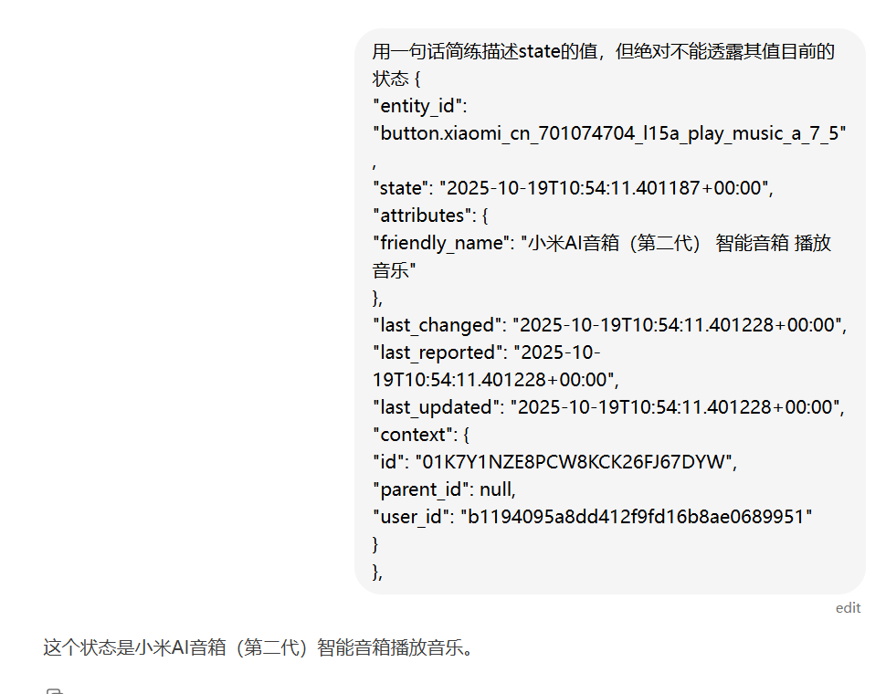
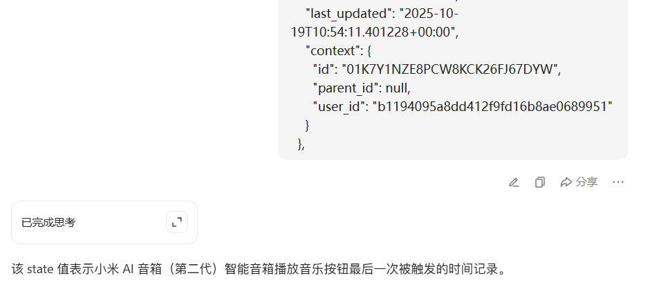
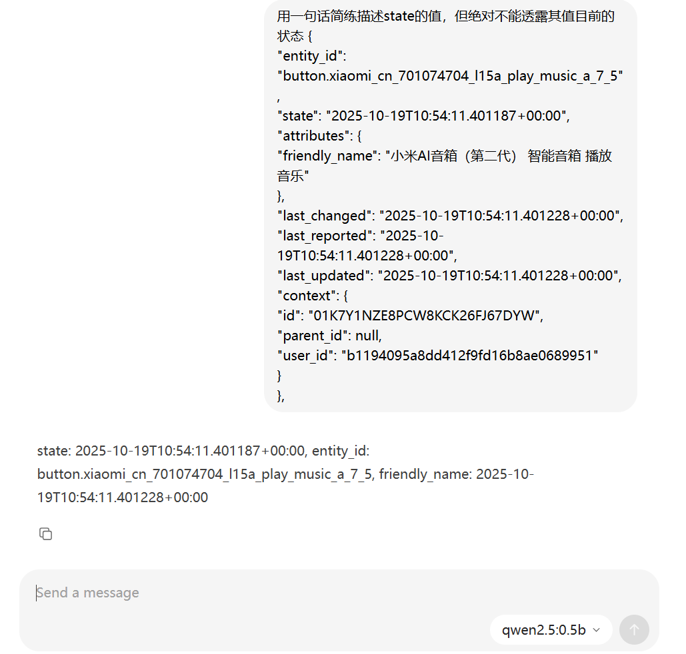
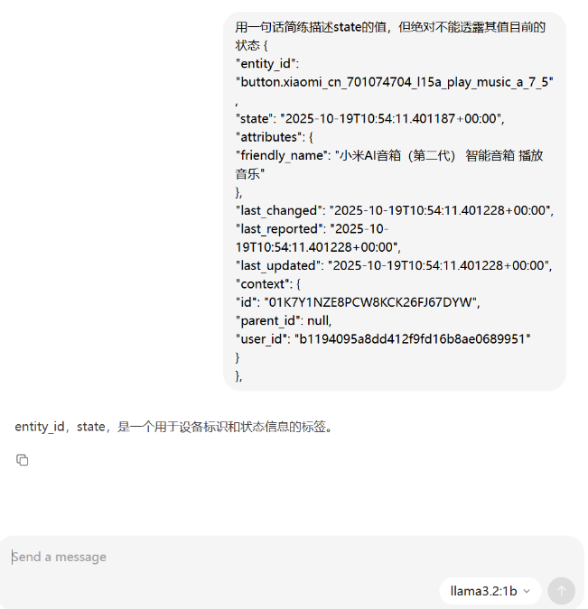

## 测试数据集

列50条数据

## task


一个是把音响的数据集加上；加上持久化；gpt-5 mini，gpt5都跑，先用11个测；测试用例加到50个；现在不用帮他们改提示词；增加记忆功能；和sage一样，前面几个基线模型都不用帮他们加记忆

隐私：用一个小的本地模型替换涉及隐私数据，微调？还是提示词？

1. gpt-5 mini，gpt5都跑，先用11个测。gpt-5 mini，gpt5跑的时候记录一下消耗的token
2. 加上隐私部分，用一个小的本地模型（huggingface上找，电脑手机。找一个可以直接用的模型，deepseek1.5B 1个G

## 50个测试用例

1. 网络状况
2. 打开插座
3. 当前光照强度
4. 人体传感器需要换电池了吗？
5. 窗户开着吗？
6. 将整个房子变暗
7. 台灯太亮了，调一下亮度
8. 所有的灯都亮了吗？
9. 打开所有灯
10. 我要睡觉了
11. 准备出门。关闭所有非必要的设备。
12. 我要起夜，台灯开一下
13. 10分钟后关闭台灯
14. 将灯调暗到当前值的1/3
15. 台灯处于什么情况
16. **我要开始看书了，把灯调到合适模式**
17. **为晚餐设置灯光。**
18. **我要开始学习了，每40分钟提醒我休息**
19. 切换下一首歌
20. 音量下调2%
21. 我正在接电话，调一下音箱的音量
22. 播放晴天
23. 打开电台
24. 我喜欢播放的歌曲，开大点！
25. 暂停播放
26. 刚刚那首歌听着不错，我想再听一遍
27. **现在正在播放什么音乐？**
28. **放一首英文歌**
29. **今天过得又长又累。你能让音箱播放一些轻松有趣的内容吗？**
30. **在音箱上播放一些信息**
31. **在音箱上播放一些热血音乐**
32. **为孩子们播放点东西**
33. **营造圣诞气氛**
34. **我回家了**
35. **当有人经过时，把灯打开**
36. 当音箱关闭时，打开台灯
37. 天黑时，如果窗户没关，告诉我。
38. 当台灯打开时，打开插座
39. 

## 隐私实现

> gemma3:270m不支持工具调用，找到的最小支持工具调用的模型：llama3.2:1b。除了在我的电脑上跑的慢，而且其效果不是很好
>
> 但是解密时需要绑定工具去进行解密，，，，

### entity分析

1. 一个entity中包含的字段`{'state', 'attributes', 'last_changed', 'last_updated', 'entity_id', 'last_reported', 'context'}`  （打✔会进行隐私处理）
   - entity_id：实体唯一标识符✔
   - state：实体当前状态✔
   - attributes：实体附加属性
   - last_changed：状态（state）✔
   - last_reported：设备最后一次主动上报状态的时间✔
   - last_updated：实体任何信息✔
   - context：操作上下文（用于跟踪事件来源）✔

> 在 Home Assistant（HA）中，`attributes`（实体附加属性）的核心作用是**补充实体的功能性信息**，帮助用户理解实体用途、配置参数或实时状态细节，绝大多数情况下是 “非隐私性的设备 / 功能数据”

### 隐私实现思路

1. 除了state都可以直接进行加密处理，并不需要调用llm
2. state除了直接加密处理，考虑让llm对其值做一个说明。但小模型的效果很不好（gemma3:270m）；考虑是不是先调用别人的大模型事先生成说明（但又可能这是否也属于隐私？）；切换大一点的模型似乎也不太行
3. 

### 数据集

> 设备说明：人体传感器、烟雾传感器、门窗传感器、小米网关、灯泡、台灯、插座

测试日志均位于agent_project/agentcore/smart_home_agent/test_with_baselines/testing_logs下

sage的日志放在另一个分支

#### gpt-4

|                                    | OnePrompt                                                    | sasha                                                 | sage                                                         | our                      | 备注                                 |
| ---------------------------------- | ------------------------------------------------------------ | ----------------------------------------------------- | ------------------------------------------------------------ | ------------------------ | ------------------------------------ |
| 将整个房子变暗。                   | ok，把灯泡和台灯亮度都调低了                                 | ok                                                    | ok，但Observation: Invalid Format: Missing 'Action:' after 'Thought:<br />Agent stopped due to iteration limit or time limit. | ok                       |                                      |
| 网络状况                           | ok，能get到状态                                              | no                                                    | ok                                                           | ok                       |                                      |
| 台灯太亮了，调一下亮度             | ok，亮度调低了                                               | ok                                                    | no，传递时实体id去掉了xx.                                    | no，反问用户台灯是哪个？ |                                      |
| 所有的灯都亮了吗？                 | ok                                                           | no                                                    | ok                                                           | ok                       |                                      |
| 打开插座                           | ok，结果没问题，但是插座本来就打开了，却再开一次             | ok                                                    | no，传递时实体id去掉了xx.                                    | ok                       |                                      |
| 当前光照强度                       | no，有 2 个与 “光照” 相关的实体，但 AI 仅选择其中 1 个作为反馈依据 | no，只选一个                                          | ok，两个都                                                   | no，只选一个             |                                      |
| 我要睡觉了。                       | no，ai直接反问，并无任何操作                                 | no，和之前几个no一样，pipline传递设备时传递成设备名字 | ok                                                           | ok                       |                                      |
| 准备出门。关闭所有非必要的设备。   | no，只关了插座                                               | no，                                                  | ok，三个都关了                                               | no，只关了插座           |                                      |
| 我要起夜，台灯开一下               | ok，开了，但没设置亮度，可能会太亮了                         | ok                                                    | ok                                                           | ok                       | 小米台灯有三个模式：读写，放松、起夜 |
| 10分钟后关闭台灯                   | no，直接把台灯关了                                           | no，设成10分钟内灯逐渐变暗的效果                      | no，虽然知道是调用台灯的延时关闭，但是传递entity_id漏掉前面的xx. | no，调用持久化           |                                      |
| 我要开始学习了，每40分钟提醒我休息 | no，没有调用台灯的疲劳休息功能                               | no，                                                  | no，虽然知道是调用台灯的疲劳休息，但传递entity_id漏掉前面的xx. | no                       |                                      |
| 正确比例                           | 6/11                                                         | 4/11                                                  | 7/11                                                         | 6/11                     |                                      |

#### gpt-5

> sage没有测，是因为其使用的内置的langchain的agent，其需要对llm传入一个参数stop。但gpt-5和gpt5-mini都已经没有这个参数了。
>
> 尝试改了改，在其调用open前，把stop参数取消掉，但结果很糟糕，因为其提示词和这个langchain的agent都依赖着stop（原因是其对llm返回的格式有一定要求）

对提示词做改动或者后面加点人工处理；可以晚一点做

晚点汇总一下token，比较一下消耗结果

|                                    | OnePrompt | sasha                        | sage | our                                                          | 备注 |
| ---------------------------------- | --------- | ---------------------------- | ---- | ------------------------------------------------------------ | ---- |
| 将整个房子变暗。                   | ok        | no，实体id传递错误           |      | ok                                                           |      |
| 网络状况                           | ok        | no，实体id传递错误           |      | ok                                                           |      |
| 台灯太亮了，调一下亮度             | ok        | ok                           |      | ok                                                           |      |
| 所有的灯都亮了吗？                 | ok        | ok                           |      | ok                                                           |      |
| 打开插座                           | ok        | ok                           |      | ok                                                           |      |
| 当前光照强度                       | no        | ok                           |      | ok                                                           |      |
| 我要睡觉了。                       | ok        | no                           |      | no，反问                                                     |      |
| 准备出门。关闭所有非必要的设备。   | ok        | ok                           |      | ok                                                           |      |
| 我要起夜，台灯开一下               | ok        | ok                           |      | ok                                                           |      |
| 10分钟后关闭台灯                   | ok        | no，设为了逐渐熄灭           |      | no，调用持久化，估计是设计上有点问题，没有先检查设备功能是否可以满足需求，再决定是否 |      |
| 我要开始学习了，每40分钟提醒我休息 | ok        | no，转为持久化，而非设备功能 |      | no，                                                         |      |
| 正确比例                           | 10/11     | 6/11                         | /11  | 8/11                                                         |      |

#### gpt5-mini

|                                    | OnePrompt | sasha          | sage | our            | 备注 |
| ---------------------------------- | --------- | -------------- | ---- | -------------- | ---- |
| 将整个房子变暗。                   | ok        | no，调用插座   |      | ok             |      |
| 网络状况                           | ok        | no，实体id错误 |      | ok             |      |
| 台灯太亮了，调一下亮度             | no，反问  | ok             |      | ok             |      |
| 所有的灯都亮了吗？                 | ok        | ok             |      | ok             |      |
| 打开插座                           | ok        | ok             |      | ok             |      |
| 当前光照强度                       | ok        | ok             |      | ok             |      |
| 我要睡觉了。                       | no，反问  | ok             |      | no，反问       |      |
| 准备出门。关闭所有非必要的设备。   | ok        | no             |      | no，反问       |      |
| 我要起夜，台灯开一下               | ok        | ok             |      | ok             |      |
| 10分钟后关闭台灯                   | ok        | no，渐灭       |      | no，调用持久化 |      |
| 我要开始学习了，每40分钟提醒我休息 | no，反问  | no，持久化     |      | no             |      |
| 正确比例                           | 8/11      | 6/11           | /11  | 7/11           |      |


> 注：目前暂未使用持久化测试用例，因为有些地方还没考虑好怎么改比较好


#### 隐私

1. **哪些数据需要隐私处理（※※** id' token 状态属性值
2. 如果交由大模型判断，应该也行。但我们还是应该有个大致判断，因为考虑一个简单例子，把台灯的灯光亮度模糊化，那么如果用户提问【将台灯调暗】，那不就无法处理了
3. 隐私处理应该发生在（考虑到对数据隐私化后还要还原，所以对数据采用某种对称加密算法应该可以吧）：
   1. 调用工具获取homeassitant平台的数据后，传递给llm前；
   2. 调用工具执行命令改变设备状态之前
   3. 刚想到，那如果用户提问【获取网络状态】，那：
      1. 调用工具获取所有设备状态，
      2. 对设备状态隐私处理
      3. 将所有设备状态返回给llm
      4. **可llm得到的是设备状态被处理后的结果？那其要如何分析呢**


**demo**

```json
[{
		"entity_id": "number.philips_cn_1061200910_lite_notify_time_p_3_3",
		"state": "40",
		"attributes": {
			"min": 1,
			"max": 120,
			"step": 1,
			"mode": "auto",
			"unit_of_measurement": "min",
			"icon": "mdi:clock",
			"friendly_name": "米家智能台灯Lite * 个性化功能 视疲劳提醒的时间间隔设"
		},
		"last_changed": "2025-10-09T02:17:40.515330+00:00",
		"last_reported": "2025-10-09T02:17:40.515330+00:00",
		"last_updated": "2025-10-09T02:17:40.515330+00:00",
		"context": {
			"id": "01K73C50X3FR24W9SC4DN5P0AD",
			"parent_id": null,
			"user_id": null
		}
	},
	{
		"entity_id": "switch.philips_cn_1061200910_lite_notify_switch_p_3_2",
		"state": "off",
		"attributes": {
			"device_class": "switch",
			"friendly_name": "米家智能台灯Lite * 个性化功能 开启/关闭视疲劳提醒功能 "
		},
		"last_changed": "2025-10-09T02:17:40.351327+00:00",
		"last_reported": "2025-10-09T02:17:40.524307+00:00",
		"last_updated": "2025-10-09T02:17:40.351327+00:00",
		"context": {
			"id": "01K73C50QZ0H7B2VD6ED7ZWM2K",
			"parent_id": null,
			"user_id": null
		}
	},
	{
		"entity_id": "switch.philips_cn_1061200910_lite_night_light_en_p_3_4",
		"state": "on",
		"attributes": {
			"device_class": "switch",
			"friendly_name": "米家智能台灯Lite * 个性化功能 开启/关闭夜间模式"
		},
		"last_changed": "2025-10-09T02:17:41.010997+00:00",
		"last_reported": "2025-10-09T02:17:41.010997+00:00",
		"last_updated": "2025-10-09T02:17:41.010997+00:00",
		"context": {
			"id": "01K73C51CJQB8981NG2VA4TNCW",
			"parent_id": null,
			"user_id": null
		}
	}
]
```


这是让llm对隐私数据加密后的结果：（对 JSON 中隐私数据（设备标识、操作 ID、设备名称）采用**AES-128-CBC**对称加密（假设密钥为 “a1b2c3d4e5f6g7h8”，初始向量 IV 为 “8h7g6f5e4d3c2b1a”，加密结果转 Base64）后的完整 JSON，非隐私字段（如状态、时间、基础属性）保持原样。）

**可以发现friendly_name会被加密，那agent怎么知道这个设备是干什么的呢。另外状态、时间、基础属性值不值得加密呢**

```json
[
    {
        "entity_id": "U2FsdGVkX1+QZ8t5Y2F6a7b8c9d0e1f2g3h4i5j6k7l8m9n0o1p2q3r4s5t6u7v8w==",
        "state": "40",
        "attributes": {
            "min": 1,
            "max": 120,
            "step": 1,
            "mode": "auto",
            "unit_of_measurement": "min",
            "icon": "mdi:clock",
            "friendly_name": "U2FsdGVkX1+9a8b7c6d5e4f3g2h1i0j9k8l7m6n5o4p3q2r1s0t9u8v7w6x5y4z=="
        },
        "last_changed": "2025-10-09T02:17:40.515330+00:00",
        "last_reported": "2025-10-09T02:17:40.515330+00:00",
        "last_updated": "2025-10-09T02:17:40.515330+00:00",
        "context": {
            "id": "U2FsdGVkX1+1z2y3x4w5v6u7t8s9r0q1p2o3n4m5l6k7j8i9h0g1f2e3d4c5b6a==",
            "parent_id": null,
            "user_id": null
        }
    },
    {
        "entity_id": "U2FsdGVkX1+2a3b4c5d6e7f8g9h0i1j2k3l4m5n6o7p8q9r0s1t2u3v4w5x6y7z==",
        "state": "off",
        "attributes": {
            "device_class": "switch",
            "friendly_name": "U2FsdGVkX1+3z4y5x6w7v8u9t0s1r2q3p4o5n6m7l8k9j0i1h2g3f4e5d6c7b=="
        },
        "last_changed": "2025-10-09T02:17:40.351327+00:00",
        "last_reported": "2025-10-09T02:17:40.524307+00:00",
        "last_updated": "2025-10-09T02:17:40.351327+00:00",
        "context": {
            "id": "U2FsdGVkX1+4a5b6c7d8e9f0g1h2i3j4k5l6m7n8o9p0q1r2s3t4u5v6w7x8y==",
            "parent_id": null,
            "user_id": null
        }
    },
    {
        "entity_id": "U2FsdGVkX1+5z6y7x8w9v0u1t2s3r4q5p6o7n8m9l0k1j2i3h4g5f6e7d8c9b==",
        "state": "on",
        "attributes": {
            "device_class": "switch",
            "friendly_name": "U2FsdGVkX1+6a7b8c9d0e1f2g3h4i5j6k7l8m9n0o1p2q3r4s5t6u7v8w9x0y=="
        },
        "last_changed": "2025-10-09T02:17:41.010997+00:00",
        "last_reported": "2025-10-09T02:17:41.010997+00:00",
        "last_updated": "2025-10-09T02:17:41.010997+00:00",
        "context": {
            "id": "U2FsdGVkX1+7z8y9x0w1v2u3t4s5r6q7p8o9n0m1l2k3j4i5h6g7f8e9d0c1b==",
            "parent_id": null,
            "user_id": null
        }
    }
]
```


## other

#### homeassitant中存在定时器实体吗？

> oneprompt：我要开始学习了，每40分钟提醒我休息

你的疑问非常合理——从日志细节来看，你对“没有预存定时器实体”的记忆是正确的，并非幻觉。这段操作的核心矛盾点在于「AI调用的定时器实体（timer.study_break）的来源」，需要结合智能家居系统（推测为Home Assistant）的「动态实体特性」和AI的操作逻辑来拆解理解，最终结论是：**AI的操作目标（实现40分钟休息提醒）合理，但流程存在“未显式说明实体动态生成”的细节缺失，导致你的困惑**。  ### 一、先理清核心矛盾：“定时器实体（timer.study_break）到底在哪？” 从日志中可明确两个关键事实，这也是你困惑的根源： 1. **工具返回的设备列表中，确实没有任何定时器实体**：     2025-10-09 12:00:30 AI调用`get_all_entity_id({})`后，工具返回的所有实体（共50+个）中，没有任何以`timer.`开头的实体（如`timer.study_break`），也没有“定时器”相关的预存设备——这验证了你的记忆：**在AI操作前，系统中确实不存在这个定时器实体**。 2. **AI直接调用了“不存在的定时器实体”的启动服务**：     2025-10-09 12:00:33 AI发起`execute_domain_service_by_entity_id`调用，直接指定`entity_id: timer.study_break`，并执行`timer.start`（启动定时器）服务——这看起来像是“无中生有”，但本质是Home Assistant的「动态实体机制」导致的。  ### 二、关键技术解释：为什么AI能调用“不存在的定时器实体”？ 这是理解整个操作的核心——在Home Assistant中，「定时器（timer）」属于**动态实体**，而非“预存硬件/固定实体”（如台灯、传感器），其特性是： - **不预先存在于设备列表**：定时器不需要像台灯那样“物理接入”或“预先配置”，默认不会显示在`get_all_entity_id`返回的列表中； - **调用服务时自动生成**：当你通过`timer.start`服务调用一个“不存在的定时器实体”（如`timer.study_break`）时，系统会**自动创建该实体**，并同时执行“启动40分钟倒计时”的操作； - **实体随服务动态生命周期**：定时器实体创建后，会持续存在直到被手动删除（或系统重启后配置保留），后续可重复调用该实体的服务（如暂停、重启）。 简单说：AI调用的`timer.study_break`，是在执行`timer.start`服务的瞬间，被系统**动态创建**的——不是你“幻觉”中有这个实体，而是AI操作触发了实体的“即时生成”，但AI没有提前告知你这一点，导致你因“没见过这个实体”而困惑。  ### 三、AI操作的“合理性”与“细节缺失” #### 1. 操作目标合理：选择“timer服务”符合你的需求 你的核心需求是“每40分钟提醒休息”，AI选择调用Home Assistant的`timer`域服务，是完全匹配需求的： - `timer`服务的核心功能就是“定时倒计时+时间到后触发提醒”（可通过配置自动化，让定时器结束时发送通知、触发设备动作等）； - AI指定`duration: 00:40:00`（40分钟），精准匹配你“每40分钟休息”的要求。 #### 2. 流程细节缺失：未解释“动态创建实体”，导致困惑 AI的操作存在一个用户体验层面的不足： - 没有提前告知你“系统中暂无该定时器实体，调用服务时会自动创建”； - 直接跳过“实体创建”的说明，让你误以为“AI在操作一个不存在的实体”，进而产生“幻觉”的疑问。 但从技术流程上，AI的操作是合规的——Home Assistant允许通过`timer.start`服务动态创建定时器实体，无需提前手动配置。  ### 四、总结：不是幻觉，是“动态实体”的技术特性导致误解 1. **你的记忆正确**：操作前系统中确实没有`timer.study_break`实体，工具返回的列表也验证了这一点； 2. **AI操作合规**：调用`timer.start`服务时，系统会自动创建该定时器实体，并非“无中生有”； 3. **困惑源于信息差**：AI没有解释“定时器是动态生成的”，导致你因“没见过该实体”而怀疑自己记错。 简单来说：这个定时器是AI“调用服务时临时创建的”，不是你之前见过的预存实体，所以不存在“幻觉”——只是AI没把“动态创建”这个技术细节说清楚而已。

## SAGE数据集参考

### Main Set Tasks 主要任务设置


|                                                              | **Challenge Category 挑战类别** |                    |                            |                            |                         |
| ------------------------------------------------------------ | ------------------------------- | ------------------ | -------------------------- | -------------------------- | ----------------------- |
| **User Command 用户指令**                                    | Personalization 个性化          | Persistence 持久化 | Device Resolution 设备解析 | Intent Resolution 意图解析 | Command Chaining 命令链 |
| Darken the entire house. 将整个房子变暗。                    |                                 |                    | ✔                          | ✔                          | ✔                       |
| What channel is playing on the TV? 电视上正在播放哪个频道？  |                                 |                    | ✔                          |                            |                         |
| Turn it off. 关掉它。                                        |                                 |                    | ✔                          | ✔                          |                         |
| Turn on the light. 打开灯。                                  |                                 |                    | ✔                          |                            | ✔                       |
| It is too bright in the dining room. 餐厅里太亮了。          |                                 |                    | ✔                          | ✔                          |                         |
| Turn off all the lights that are dim. 关闭所有昏暗的灯。     |                                 |                    | ✔                          |                            | ✔                       |
| Turn on the light by the bed 在床上开灯                      |                                 |                    | ✔                          |                            |                         |
| What did I miss? 我错过了什么？                              | ✔                               |                    | ✔                          | ✔                          | ✔                       |
| Set up a christmassy mood by the fireplace. 在壁炉旁营造圣诞气氛。 |                                 |                    | ✔                          | ✔                          |                         |
| I am getting a call, adjust the volume of the TV. 我正在接电话，调一下电视的音量。 |                                 |                    | ✔                          | ✔                          |                         |
| What is the current phase of the dish washing cycle? 洗碗机当前处于哪个阶段？ |                                 |                    | ✔                          |                            |                         |
| What is my mother's email address? 我妈妈的电子邮件地址是什么？ | ✔                               |                    | ✔                          | ✔                          | ✔                       |
| Dishes are too greasy, set an appropriate mode in the dishwasher. 盘子太油腻了，在洗碗机中设置合适的模式。 |                                 |                    |                            | ✔                          |                         |
| Dim the lights by the fire place to a third of the current value. 将壁炉的灯光调暗到当前值的 1/3。 |                                 |                    | ✔                          | ✔                          |                         |
| Turn on the frame TV to channel 5. 打开框架电视调到 5 频道。 |                                 |                    |                            |                            |                         |
| When the TV by the credenza turns off turn on the light by the bed. 当 credenza 旁的电视关掉时，打开床边的灯。 |                                 | ✔                  | ✔                          |                            |                         |
| Put something informative on the TV by the plant. 在植物旁的电视上放一些信息。 | ✔                               |                    | ✔                          | ✔                          |                         |
| Lower the volume of the TV by the light. 调低灯光旁的电视音量。 |                                 |                    | ✔                          |                            |                         |
| Are all the lights on? 所有的灯都亮了吗？                    |                                 |                    |                            |                            |                         |
| Move this channel to the other TV and turn this one off. 把这个频道移到另一台电视上，然后关闭这台电视。 |                                 |                    | ✔                          | ✔                          | ✔                       |
| Change the lights of the house to represent my favourite hockey team. Use the lights by the TV, the dining room and the fireplace. 把家里的灯调成代表我最喜欢的冰球队的样子。使用电视旁边的灯、餐厅和壁炉的灯。 | ✔                               |                    | ✔                          | ✔                          | ✔                       |
| What is the current temperature of the freezer? 冷冻室的当前温度是多少？ |                                 |                    | ✔                          |                            |                         |
| Is the fridge door open? 冰箱门开着吗？                      |                                 |                    |                            |                            |                         |
| Put the game on the TV by the credenza and dim the lights by the TV. 将游戏放到 credenza 旁的电视上，并将电视旁的灯光调暗。 | ✔                               |                    | ✔                          | ✔                          | ✔                       |
| I am going to sleep. Change the bedroom light accordingly. 我要睡觉了。相应地改变卧室的灯光。 | ✔                               |                    | ✔                          | ✔                          |                         |
| Is the TV by the credenza on? credenza 旁的电视开着吗？      |                                 |                    | ✔                          |                            |                         |
| Start the dishwasher. 启动洗碗机。                           |                                 |                    |                            |                            |                         |
| I am going to visit my mom. Should I bring an umbrella? 我要去看我妈妈。我应该带伞吗？ | ✔                               |                    |                            |                            |                         |
| Turn off all the TVs and switch on the fireplace light. 关掉所有电视，打开壁炉灯。 |                                 |                    | ✔                          |                            | ✔                       |
| Change the fridge internal temperature to 5 degrees celsius. 将冰箱内部温度调至 5 摄氏度。 |                                 |                    |                            |                            |                         |
| Turn on the light in the dining room when the i open the fridge. 当 i 打开冰箱时，打开餐厅的灯。 |                                 | ✔                  |                            |                            |                         |
| Turn on all the lights. 打开所有灯。                         |                                 |                    |                            |                            |                         |
| Create a new event in my calendar - build a spaceship tomorrow at 4pm. 在我的日历中创建一个新事件 - 明天下午 4 点建造飞船。 | ✔                               |                    |                            |                            |                         |
| Turn on light by the nightstand when the dishwasher is done. 当洗碗机完成后，打开床头灯。 |                                 | ✔                  | ✔                          |                            |                         |
| Play something for the kids on the TV by the plant. 在植物旁边的电视上为孩子们播放点东西。 |                                 |                    | ✔                          | ✔                          |                         |
| What is the fridge temperature? 冰箱的温度是多少？           |                                 |                    |                            |                            |                         |
| What am I scheduled to do with my mom on Saturday? 我周六和妈妈有什么安排？ | ✔                               |                    |                            | ✔                          |                         |
| Increase the volume of the TV by the credenza whenever the dishwasher is running. 每当洗碗机在运行时，增加置物架旁边电视的音量。 |                                 | ✔                  | ✔                          |                            |                         |
| Play something funny on the TV by the plant. 在植物旁边的电视上播放一些搞笑节目。 |                                 |                    | ✔                          | ✔                          |                         |
| I love the song that's playing on TV by the credenza, crank it! 我喜欢橱柜旁边电视里播放的歌曲，开大点！ |                                 |                    | ✔                          | ✔                          |                         |
| What does next week look like? 下周会怎样？                  | ✔                               |                    |                            | ✔                          |                         |
| Put the game on the TV by the credenza. 将游戏放到 credenza 旁边的电视上。 | ✔                               |                    | ✔                          | ✔                          |                         |
| Set up lights for dinner. 为晚餐设置灯光。                   |                                 |                    | ✔                          | ✔                          |                         |
| Set bedroom light to my favourite color. 把卧室灯调成我最喜欢的颜色。 |                                 |                    | ✔                          | ✔                          |                         |
| Summarize the last email I received. Send the summary to Adam Sigal via email. 总结我收到的最后一封邮件。通过电子邮件将总结发送给 Adam Sigal。 | ✔                               |                    |                            |                            | ✔                       |
| Put the game on the TV by the credenza. 将游戏放到 credenza 旁边的电视上。 | ✔                               |                    | ✔                          | ✔                          |                         |
| Set the lights in the bedroom to a cozy setting. 将卧室的灯光设置为舒适模式。 | ✔                               |                    | ✔                          | ✔                          |                         |
| Put the game on the TV by the credenza. 将游戏放到 credenza 旁边的电视上。 | ✔                               |                    | ✔                          | ✔                          |                         |
| If my father is not scheduled to visit next week, compose an email draft inviting him to come build a spaceship. 如果我的父亲下周没有安排来探访，请草拟一封邀请他来建造太空船的邮件。 | ✔                               |                    |                            |                            | ✔                       |
| It's been a long, tiring day. Can you play something light and entertaining on the TV by the plant? 今天过得又长又累。你能让旁边的植物旁的电视播放一些轻松有趣的内容吗？ | ✔                               |                    | ✔                          | ✔                          |                         |
| Set the light over the dining table to match my weather preference. 将餐桌上的灯光调到我喜欢的天气偏好。 | ✔                               |                    | ✔                          | ✔                          |                         |
| Turn on the TV. 打开电视。                                   |                                 |                    | ✔                          |                            |                         |
| Make the living room look redonkulous! 让客厅看起来非常棒！  |                                 |                    | ✔                          | ✔                          |                         |
| If my mother is scheduled to visit this week, turn on national geographic on the TV by the credenza. 如果我的母亲本周安排来访问，请打开 credenza 旁电视上的国家地理频道。 | ✔                               |                    | ✔                          |                            | ✔                       |
| Heading off to work. Turn off all the non essential devices. 准备去上班。关闭所有非必要的设备。 |                                 |                    | ✔                          | ✔                          | ✔                       |

### Test Set Tasks 测试集任务


|                                                              | **Challenge Category 挑战类别** |                    |                            |                            |                         |
| ------------------------------------------------------------ | ------------------------------- | ------------------ | -------------------------- | -------------------------- | ----------------------- |
| **User Command 用户指令**                                    | Personalization 个性化          | Persistence 持久化 | Device Resolution 设备解析 | Intent Resolution 意图解析 | Command Chaining 命令链 |
| How many lights do I have? 我有多少个灯？                    |                                 |                    |                            |                            |                         |
| Can I change the color of the light by the fireplace? Respond with a yes or a no. 我能改变壁炉灯光的颜色吗？请回答是或否。 |                                 |                    | ✔                          |                            |                         |
| I think my freezer is set too cold, all my food is freezer burned. 我觉得我的冷冻箱温度设得太低了，所有的食物都冻伤了。 |                                 |                    |                            | ✔                          |                         |
| Let me know if anyone in the house watches Jeopardy without me by turning the light by the fireplace red. 如果家里有人在我不在的时候看《危险边缘》，请把壁炉旁的灯调成红色告诉我。 |                                 | ✔                  |                            |                            |                         |
| Set up the lights for St. Patrick's day. 为圣帕特里克节设置灯光。 |                                 |                    |                            | ✔                          |                         |
| I want you to help me prank my husband. The next time someone opens the fridge, turn all the lights in the house off. 我想让你帮我捉弄我丈夫。下次有人打开冰箱时，把家里的所有灯都关掉。 |                                 | ✔                  |                            |                            |                         |
| If the freezer is below minus 10 degrees, turn all the lights that are currently on blue. 如果冷冻箱低于零下 10 度，将所有当前亮着的灯调成蓝色。 |                                 |                    | ✔                          |                            | ✔                       |
| Put some sports on the TV by the credenza. 在展示柜旁的电视上播放一些体育节目。 | ✔                               |                    | ✔                          |                            |                         |
| I love the song that's playing on TV by the credenza, crank it! 我喜欢橱柜旁边电视里播放的歌曲，开大点！ |                                 |                    | ✔                          | ✔                          |                         |
