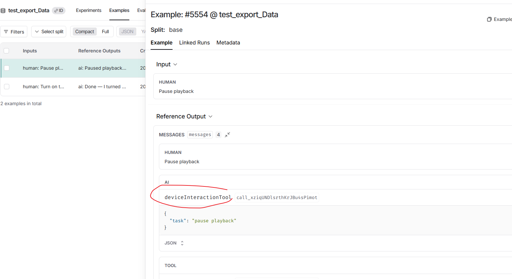

1. 我是在langsmith后台上试了试，发现添加到数据库不行，不能有完整的对话记录
2. 最新的官方文档上有提到导出跟踪数据，但要钱，而且还需要 一个 S3 bucket or S3 API。也不知道导出的数据长什么样，能不能成是未知。[设置自动化规则 - LangChain 文档 --- Set up automation rules - Docs by LangChain](https://docs.langchain.com/langsmith/data-export#destinations)

## 添加数据库的尝试

并不能显示出设备交互工具的记录

## 官方文档上提到的导出

1. **数据导出功能仅支持 LangSmith Plus （39$）或企业版。**

2. 要导出 LangSmith 数据，您**需要提供一个 S3 存储桶**，数据将导出到该存储桶。（S3 bucket 是亚马逊 AWS 云服务中的**对象存储容器**。或者自己部署兼容 S3 API 的存储服务，不过需要一个公网ip暴露给langsmith）

最重要的是不知道其导出的数据长什么样，完不完整，能不能用来分析。文档上并没有说明例子