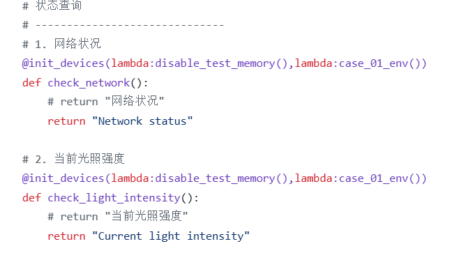
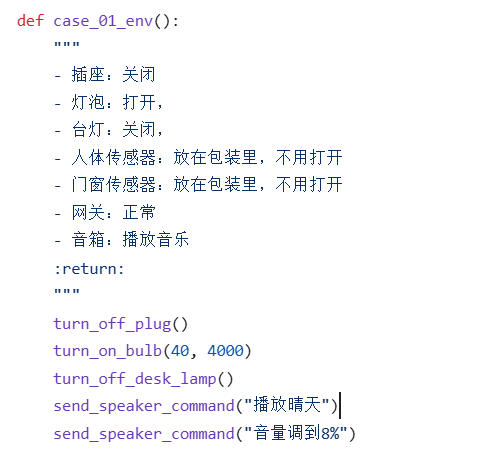
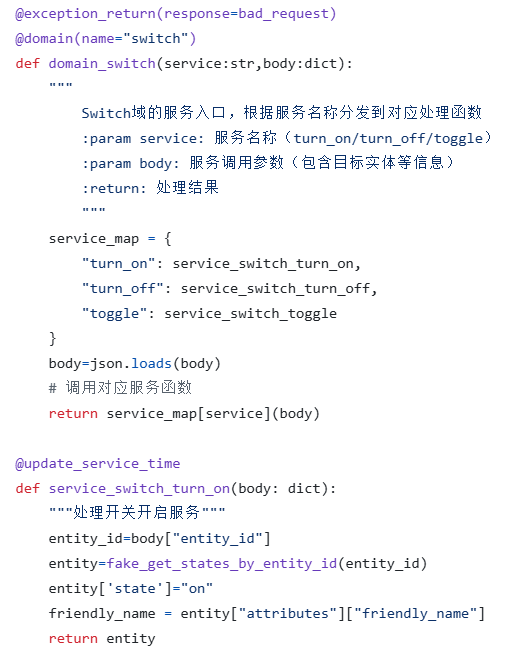

### 在真实设备上测试

1. 在py文件中写好50个测试用例，详见：[agent_project/agentcore/smart_home_agent/test_with_baselines/test_cases.py at master · shuashua522/agent_project](https://github.com/shuashua522/agent_project/blob/master/agentcore/smart_home_agent/test_with_baselines/test_cases.py)
2. 为这50个测试用例准备环境（每次调用这些用例前，先初始化环境，比如在测试打开台灯和插座这一用例前，先把台灯和插座关闭）。[说是这么说，但实际代码并不一定严谨，就比如测试打开台灯和插座这一用例前，我可能只把台灯和插座关了，其他设备就没管]。详见：[agent_project/agentcore/smart_home_agent/test_with_baselines/devices_init.py at master · shuashua522/agent_project](https://github.com/shuashua522/agent_project/blob/master/agentcore/smart_home_agent/test_with_baselines/devices_init.py)
3. 依次将这50个测试用例的问题传入agent
4. 结果：看agent日志是否完成用例所需操作（比如将灯调暗，是否将灯调暗了）

### 模拟homeassitant处理设备过程

**如何实现的模拟：**

1. homeassitant关于设备的API就四个：获取所有实体；根据实体ID获取某一实体状态；获取某一domain下的所有service；对某一实体执行service。homeassitant api官方文档：[REST API | Home Assistant Developer Docs](https://developers.home-assistant.io/docs/api/rest/)
2. 获取所有实体：调用homeassitant的API得到真实设备的json格式的数据。保存的数据可见于：[agent_project/agentcore/smart_home_agent/fake_request/entities.json at master · shuashua522/agent_project](https://github.com/shuashua522/agent_project/blob/master/agentcore/smart_home_agent/fake_request/entities.json)
3. service：调用homeassitant的API得到所有service信息，json格式。保存的数据可见于：[agent_project/agentcore/smart_home_agent/fake_request/services.json at master · shuashua522/agent_project](https://github.com/shuashua522/agent_project/blob/master/agentcore/smart_home_agent/fake_request/services.json)
4. **如何模拟homeassitant执行操作：**分析service和entity所描述的信息，比如这个实体是否支持色温调节，单位是什么，范围是多少。实现可见于：[agent_project/agentcore/smart_home_agent/fake_request/fake_do_service.py at master · shuashua522/agent_project](https://github.com/shuashua522/agent_project/blob/master/agentcore/smart_home_agent/fake_request/fake_do_service.py)

**测试**

和之前描述的在真实设备上测试的过程一致，只是把调用的所有homeassitant的API的地方改成调用模拟的fake_api